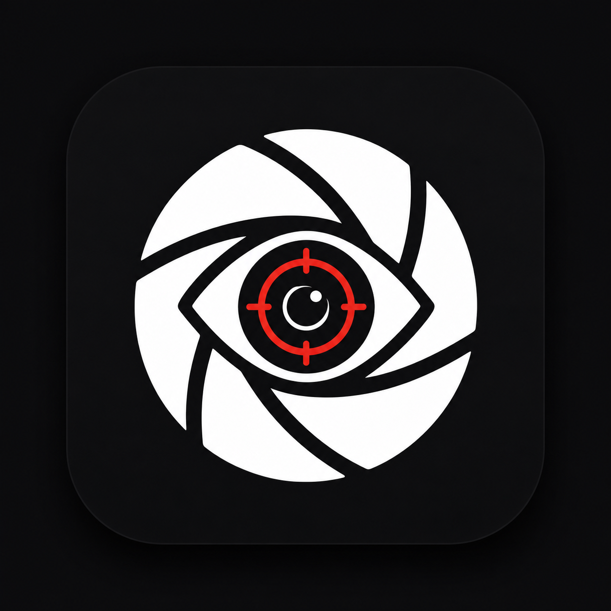

> [!NOTE]
> **[MetaForensic PRO LAB v2.0 is officially live!](https://metaforensic.vercel.app/)**

<div align="center">



# 🔍 MetaForensic — Browser Image Forensics & OSINT Suite

<p align="center">
  <b>100% Client-Side • Privacy-First • Advanced Metadata & Visual Inspection</b>
</p>

<p align="center">
  <b>Developed with ❤️ by <a href="https://github.com/jojin1709">JOJIN JOHN</a></b>
</p>

<p align="center">
  <a href="https://metaforensic.vercel.app/" target="_blank">
    
  </a>
</p>

Drop an image to extract hidden device EXIF headers, GPS coordinates, timestamp anomalies, Error Level Analysis (ELA) heatmaps, LSB steganography bit planes, color channels, clone detection, side-by-side comparison, and PDF evidence reports.

---

</div>

> [!TIP]
> **Privacy Guarantee:** All image parsing, canvas filtering, EXIF parsing, and binary analysis run **100% locally inside your browser**. Your images are never uploaded to any remote server.

## Table of Contents

- [What is MetaForensic?](#what-is-metaforensic)
- [Why MetaForensic Exists](#why-metaforensic-exists)
- [Access the Web Application](#access-the-web-application)
- [Key Capabilities](#key-capabilities)
- [Architecture & Analysis Workflow](#architecture--analysis-workflow)
- [Security & Privacy Model](#security--privacy-model)
- [Author & Credits](#author--credits)
- [License](#license)

---

## What is MetaForensic?

**MetaForensic** is an open-source, browser-based Image Forensics and Open Source Intelligence (OSINT) suite developed by **JOJIN JOHN** for security researchers, digital forensic investigators, OSINT analysts, and privacy advocates.

It performs comprehensive static and dynamic analysis on digital images to detect manipulations, re-encoding footprints, stripped metadata, hidden payload data, and geographic origin.

### Why MetaForensic Exists

In digital investigations and bug bounty hunting, photos are frequently stripped, edited, or re-compressed across platforms like WhatsApp, Telegram, or Photoshop. Manually chasing EXIF tags, calculating perceptual hashes, inspecting LSB bit-planes, and running ELA re-compression maps in separate command-line tools is tedious.

MetaForensic unifies all these visual and binary forensic tools into a single, high-performance web interface.

---

## 🌐 Access the Web Application

MetaForensic is deployed as a zero-installation, instant web application accessible directly in any modern desktop or mobile browser:

<div align="center">

### 👉 **[https://metaforensic.vercel.app/](https://metaforensic.vercel.app/)** 👈

</div>

> [!IMPORTANT]
> No installation, Node.js setup, or terminal commands are required. Simply open [https://metaforensic.vercel.app/](https://metaforensic.vercel.app/) and drop any photo to begin analyzing metadata and forensic heatmaps instantly.

---

## Key Capabilities

### 1. 🔬 Advanced Pixel & Visual Forensics
- **Color Channel Isolation**: Split images into Red, Green, Blue, Alpha, Hue, Saturation, Value, Y (Luminance), Cb, and Cr channels to spot localized edits.
- **Luminance & Sobel Gradient Map**: Analyze lighting direction and shadow boundary consistency across subjects.
- **High-Pass Noise Filter**: Highlight smoothed, airbrushed, or AI-retouched regions that lack natural sensor noise.
- **Copy-Move / Clone Stamp Detector**: Block-matching algorithm identifying candidate cloned pixel patches.
- **Interactive Pixel Loupe / Magnifier**: Real-time cursor lens with 10x–50x zoom, RGB values, hex codes (`#FF5733`), and pixel grid alignment.

### 2. 📑 Deep Metadata & Platform Fingerprinting
- **Searchable Tag Explorer**: Live search filter across raw EXIF, XMP, IPTC, ICC, and Photoshop tags with 1-click tag copy.
- **Platform Stripping Fingerprint Detector**: Automatically identifies platform signatures (*WhatsApp, Telegram, Facebook/Instagram CDN, Twitter, Adobe Photoshop, GIMP, Apple iOS*).

### 3. 🛡️ Steganography & Binary Inspection
- **LSB Bit-Plane Stego Visualizer**: Inspect bit planes (Bit 0..7) across channels to expose hidden payload images or encrypted data.
- **Hex Viewer & ASCII String Extractor**: Interactive offset byte viewer and automated ASCII string parser.
- **PNG & WebP Chunk Inspector**: Inspects PNG (`IHDR`, `tEXt`, `IDAT`, `IEND`) and WebP RIFF blocks for appended hidden payloads.

### 4. 📄 Professional Reporting & Utilities
- **Printable PDF / HTML Report Generator**: Instant printable report with map pin, metadata table, and ELA renders.
- **Side-by-Side Image Compare & XOR Diff**: Interactive curtain slider and pixel XOR difference heatmap.
- **Multi-File Batch Folder Analysis**: Batch dropzone with cross-file perceptual hash duplicate matching.

---

## Architecture & Analysis Workflow

MetaForensic uses a multi-stage parallel analysis pipeline running entirely within the client's Web Content Environment:

```text
       ┌──────────────────────────────┐
       │     Input Evidence Image     │
       └──────────────┬───────────────┘
                      │
                      ▼
       ┌──────────────────────────────┐
       │   Browser ArrayBuffer Reader │
       └──────────────┬───────────────┘
                      │
        ┌─────────────┼─────────────┐
        │             │             │
        ▼             ▼             ▼
  ┌───────────┐ ┌───────────┐ ┌───────────┐
  │ EXIF /    │ │ HTML5     │ │ Binary    │
  │ XMP / GPS │ │ Canvas    │ │ Container │
  │ Extractor │ │ Engine    │ │ Parser    │
  └─────┬─────┘ └─────┬─────┘ └─────┬─────┘
        │             │             │
        ▼             ▼             ▼
  ┌───────────┐ ┌───────────┐ ┌───────────┐
  │ Address   │ │ ELA / LSB │ │ Stego &   │
  │ Geocode   │ │ Channels  │ │ Chunks    │
  └─────┬─────┘ └─────┬─────┘ └─────┬─────┘
        │             │             │
        └──────┬──────┴─────────────┘
               │
               ▼
       ┌──────────────────────────────┐
       │ Consolidated Forensic Dashboard │
       └──────────────────────────────┘
```

---

## 🚀 MetaForensic v3.0 — Future Technical Roadmap

The following advanced forensic modules and OSINT features are planned for future major releases:

### 🤖 AI & Synthetic Media Forensics
- **Client-Side AI Deepfake Detector (`ONNX.js`)**: Run local WebAssembly neural networks to spot synthetic AI images (Midjourney, DALL-E 3, Flux, Stable Diffusion).
- **PRNU Camera Ballistic Fingerprinting**: Extract microscopic sensor noise patterns (Photo-Response Non-Uniformity) to match evidence photos back to a specific physical camera sensor.

### 🎥 Media & Container Expansion
- **Video & Audio Container Inspector**: Support MP4, MOV, and WAV containers to extract frame rates, audio codecs, and embedded camera metadata streams.
- **JPEG DQT Quantization Matrix Profiler**: Extract raw Define Quantization Tables (DQT) to detect double-JPEG compression passes and match quality matrices against known camera models.

### ☀️ OSINT & Environmental Intelligence
- **Solar Angle & Shadow Verification (`SunCalc`)**: Calculate solar elevation and azimuth based on GPS coordinates and capture timestamps to mathematically audit shadow consistency.
- **Historical Weather & Satellite Cross-Check**: Query historical weather logs for the exact time and location to verify cloud cover, rain, and temperature depicted in evidence photos.
- **One-Click Reverse Image Search Shortcuts**: Compute perceptual feature vectors and generate direct OSINT search queries for Google Lens, Yandex, TinEye, and PimEyes.
- **Camera Serial Number OSINT Search**: Extract camera body and lens serial numbers to query stolen camera registries (StolenCameraFinder / CamTrace).

### 🔏 Cryptographic & Steganography Advanced Analysis
- **C2PA / CAI Cryptographic Signature Verification**: Validate Content Authenticity Initiative (C2PA) cryptographic manifests embedded by modern Leica, Sony, and Nikon cameras.
- **Steganography Payload Extractor & Decryptor**: Extract hidden files embedded inside LSB channels with optional AES-256 / XOR password decryption.
- **Copy-Move & Clone Detection Vector Map**: Run ORB/SIFT keypoint matching on canvas to highlight cloned pixel regions with visual connecting vectors.

### ⚡ Performance & Offline Air-Gapped Field Lab
- **Web Worker Offload Threading**: Move ELA, Sobel, and channel splitting to background Web Workers for async processing of 50MB+ RAW photos.
- **Air-Gapped Offline PWA (Progressive Web App)**: Service Worker caching allowing field agents to run MetaForensic 100% offline in isolated forensic labs.
- **Optical Character Recognition (OCR)**: Integrated Tesseract.js engine to extract text, street signs, and license plates inside the browser.
- **Legal PDF Dossier & Encrypted Case Files (`.metaforensic`)**: Export encrypted project bundles and generate court-admissible legal PDF reports with digital SHA-256 signatures.

---

## Security & Privacy Model

- **Zero Server Uploads**: Images uploaded to MetaForensic are parsed in-memory using browser Web APIs (`FileReader`, `HTMLCanvasElement`, `WebAssembly`).
- **Reverse Geocoding**: GPS coordinate lookups are sent to the public OpenStreetMap Nominatim API *only* if the photo contains embedded GPS latitude/longitude (no image data is sent).

---

## Author & Credits

<p align="center">
  <b>Developed & Maintained by <a href="https://github.com/jojin1709">JOJIN JOHN</a></b>
</p>

## License

Copyright (c) 2026 JOJIN JOHN. All Rights Reserved.

Unauthorised copying, reproduction, distribution, or host redeployment of this software or source code is strictly prohibited.

